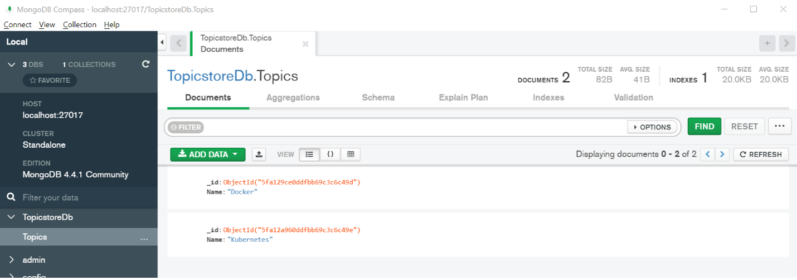
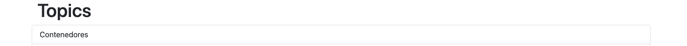

Ejercicio 1

Dockeriza la aplicación dentro de lemoncode-challenge, la cual está compuesta de 3 partes:

    Un front-end con Node.js
    Un backend en .NET que utiliza un MongoDB para almacenar la información.
    El MongoDB donde se almacena la información en una base de.

Requisitos del ejercicio:

    Los tres componentes deben estar en una red llamada lemoncode-challenge.
    El backend debe comunicarse con el mongodb a través de esta URL mongodb://some-mongo:27017
    El front-end debe comunicarse con la api a través de http://topics-api:5000/api/topics
    El front-end debe estar mapeado con el host para ser accesible a través del puerto 8080.
    El MongoDB debe almacenar la información que va generando en un volumen, mapeado a la ruta /data/db.
    Este debe de tener una base de datos llamada TopicstoreDb con una colección llamada Topics. La colección Topics debe tener esta estructura: {"_id":{"$oid":"5fa2ca6abe7a379ec4234883"},"Name":"Contenedores"} ¡Añade varios registros!

Tip para backend: Antes de intentar contenerizar y llevar a cabo todos los pasos del ejercicio se recomienda intentar ejecutar la aplicación sin hacer cambios en ella. En este caso, lo único que es posible que “no tengamos a mano” es el MongoDB. Por lo que empieza por crear este en Docker, usa un cliente como el que vimos en el primer día de clase (MongoDB Compass) para añadir datos que pueda devolver la API.

Nota: es más fácil si abres Visual Studio Code desde la carpeta backend para hacer las pruebas y las modificaciones que si te abres desde la raíz del repo. Para ejecutar este código solo debes lanzar dotnet run

Tip para frontend: Para ejecutar el frontend abre esta carpeta en VS Code y ejecuta primero npm install. Una vez instaladas las dependencias ya puedes ejecutarla con npm start. Debería de abrirse un navegador con lo siguiente:

Ejercicio 2

Ahora que ya tienes la aplicación del ejercicio 1 dockerizada, utiliza Docker Compose para lanzar todas las piezas a través de este. Debes plasmar todo lo necesario para que esta funcione como se espera: la red que utilizan, el volumen que necesita MongoDB, las variables de entorno, el puerto que expone la web y la API. Además debes indicar qué comandos utilizarías para levantar el entorno, pararlo y eliminarlo.
