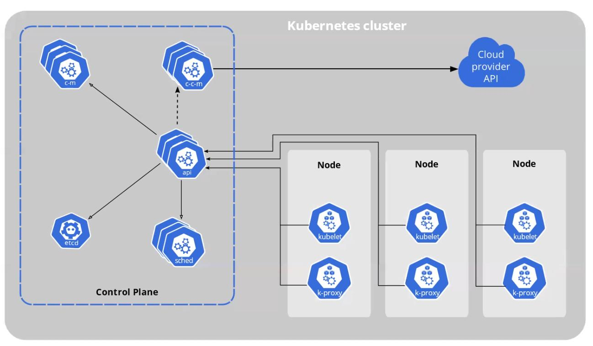

# Kubernetes

## Herramientas local

- Docker Desktop
- [Minikube](https://minikube.sigs.k8s.io/docs/)
- [Kind](https://kind.sigs.k8s.io/)
- [Rancher Desktop](https://rancherdesktop.io/)
- [MiniK8s](https://microk8s.io/)
- [Kubectl](https://kubernetes.io/es/docs/tasks/tools/install-kubectl/)

**Docker Desktop**: Dos clicks, en interfaz gráfica
**Minikube**: Es el k8s de desarrollo oficial. Ejecutable, que con el comando `minikube start` levanta un kubernetes en local. Puede ejecutar k8s de varias maneras. Por defecto usa "docker para ejecutar k8s para ejecutar docker". Si hacemos `minikube` nos muestra todos los comandos que tiene para desarrollo y simplificarnos el desarrollo con k8s.
**Kind**: Kubernetes in Docker, soporta clúster multinodo, y el clúster creado es muy básico. Es perfecto para crear un k8s de usar y tirar para test de integracion
**Rancher Desktop**: Permite ejecutar un k8s sencilla sin necesidad de tener el docker desktop parado. Directamente ejecuta el daemon de ContainerD.
**MiniK8s**: Kubernetes para Linux (paquete snap).
**Kubectl**: Herramienta de comandos con la que vamos a trabajar.

Da soporte a una version minor de +- 1, es decir:

```bash
$ kubectl version
Client Version: version.Info{Major:"1", Minor:"22", GitVersion:"v1.22.4", GitCommit:"b695d79d4f967c403a96986f1750a35eb75e75f1", GitTreeState:"clean", BuildDate:"2021-11-17T15:41:42Z", GoVersion:"go1.16.10", Compiler:"gc", Platform:"darwin/amd64"}
Server Version: version.Info{Major:"1", Minor:"20", GitVersion:"v1.20.2", GitCommit:"faecb196815e248d3ecfb03c680a4507229c2a56", GitTreeState:"clean", BuildDate:"2021-01-13T13:20:00Z", GoVersion:"go1.15.5", Compiler:"gc", Platform:"linux/amd64"}
WARNING: version difference between client (1.22) and server (1.20) exceeds the supported minor version skew of +/-1

$ minikube start --kubernetes-version=v1.22.4
😄  minikube v1.24.0 en Darwin 12.0.1
✨  Using the hyperkit driver based on existing profile
👍  Starting control plane node minikube in cluster minikube
🔄  Restarting existing hyperkit VM for "minikube" ...
    > kubelet.sha256: 64 B / 64 B [--------------------------] 100.00% ? p/s 0s
    > kubectl.sha256: 64 B / 64 B [--------------------------] 100.00% ? p/s 0s
    > kubeadm.sha256: 64 B / 64 B [--------------------------] 100.00% ? p/s 0s
    > kubectl: 44.76 MiB / 44.76 MiB [-------------] 100.00% 46.67 MiB p/s 1.2s
    > kubelet: 115.58 MiB / 115.58 MiB [-----------] 100.00% 72.69 MiB p/s 1.8s
    > kubeadm: 43.72 MiB / 43.72 MiB [-------------] 100.00% 25.06 MiB p/s 1.9s

🔎  Verifying Kubernetes components...
    ▪ Using image gcr.io/k8s-minikube/storage-provisioner:v5
🌟  Complementos habilitados: storage-provisioner, default-storageclass
🏄  Done! kubectl is now configured to use "minikube" cluster and "default" namespace by default

$ kubectl version
Client Version: version.Info{Major:"1", Minor:"22", GitVersion:"v1.22.4", GitCommit:"b695d79d4f967c403a96986f1750a35eb75e75f1", GitTreeState:"clean", BuildDate:"2021-11-17T15:41:42Z", GoVersion:"go1.16.10", Compiler:"gc", Platform:"darwin/amd64"}
Server Version: version.Info{Major:"1", Minor:"22", GitVersion:"v1.22.4", GitCommit:"b695d79d4f967c403a96986f1750a35eb75e75f1", GitTreeState:"clean", BuildDate:"2021-11-17T15:42:41Z", GoVersion:"go1.16.10", Compiler:"gc", Platform:"linux/amd64"}
```

## Kubectl

- Kubectl es la herramienta de CLI de K8s
- Absolutamente todo se puede hacer desde kubectl
- Se conecta al cluster a traves de la API que este expone
- Cualquiera se puede hacer su propio cliente de kubernetes, porque la API es pública

## Kubernetes por dentro

Un cluster tiene dos tipos de nodos:

- Worker, que ejecutan contenedores
- Master, que ejecutan el control plain

En principio en un kubernetes de produccion se dedican a ejecutar exclusivamente nodos control plane.
Para tener un cluster de alta disponibilidad se necesitan tres nodos master y dos nodos worker. Cinco máquinas que tres no van a ejecutar contenedores.
Esto te soporta la caida de un nodo master y un nodo worker.



- Control Plane: es el core de kubernetes. Lo ejecutan nodos master.
- Api: Api Server. Tenemos una Api-rest con la que nos comunicamos con k8s, que se dedica a recibir todas las peticiones http. Es un componente critico. Esta api, la llamamos desde fuera, y los componentes de k8s, para pedir informacion y tomar acciones. Si se cae este componente, el cluster deja de estar operativo.
- ccm: Cloud Control Manager. Son como watcher, se encargan de monitorizar los contenedores de tu cluster.
- cm: Control Manager. Son como watcher, se encargan de monitorizar los contenedores de tu cluster.
  etcd: etcd persistent store. Es una bbdd clave valor de altisimo rendimiento, tienes que tener backups de el continuamente. Todo el estado del cluster se guarda aquí.
- sched: Scheduler. su unico trabajo es repartir la carga de trabajo en los nodos worker
- k-proxy: kube-proxy. Crea red virtual entre todos los nodos.
- kubelet: kubelet es un daemon, no se ejecuta como contenedor, es el responsable de que ese nodo haga lo que le digan. Le va preguntando al CP o API qué tiene que hacer

## Picando

minikube start
k version

```bash
$ k version
Client Version: version.Info{Major:"1", Minor:"22", GitVersion:"v1.22.2", GitCommit:"8b5a19147530eaac9476b0ab82980b4088bbc1b2", GitTreeState:"clean", BuildDate:"2021-09-15T21:38:50Z", GoVersion:"go1.16.8", Compiler:"gc", Platform:"linux/amd64"}
Server Version: version.Info{Major:"1", Minor:"22", GitVersion:"v1.22.2", GitCommit:"8b5a19147530eaac9476b0ab82980b4088bbc1b2", GitTreeState:"clean", BuildDate:"2021-09-15T21:32:41Z", GoVersion:"go1.16.8", Compiler:"gc", Platform:"linux/amd64"}
```
